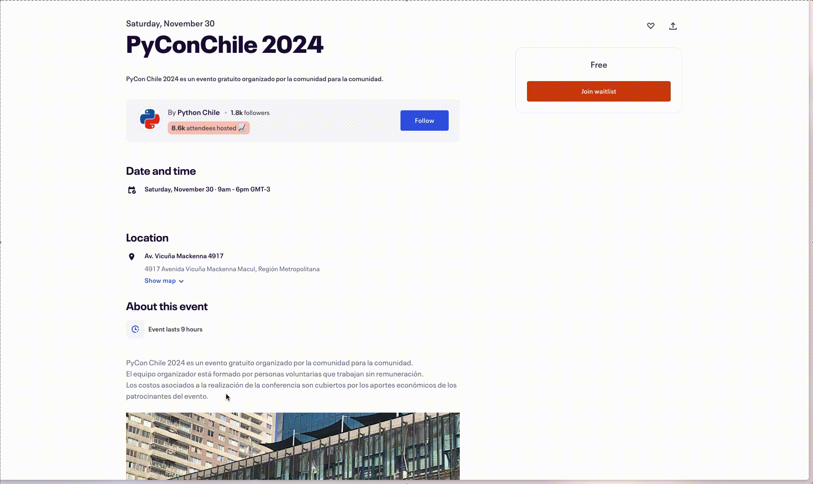

# gCalAi

Chrome extension to create Google Calendar events from selected text and using AI.

If you'd like, you can buy me a coffee 

## Usage

1. Config OpenAI api key on the extension settings page
2. Do the same as the video

## Install

Install as developer. Step 2 of [this tutorial](https://support.google.com/chrome/a/answer/2714278?hl=en#:~:text=Go%20to%20chrome%3A%2F%2Fextensions,the%20app%20or%20extension%20folder.)
